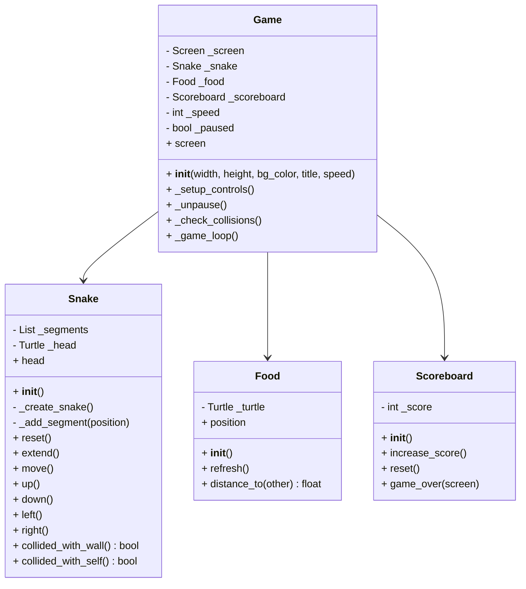
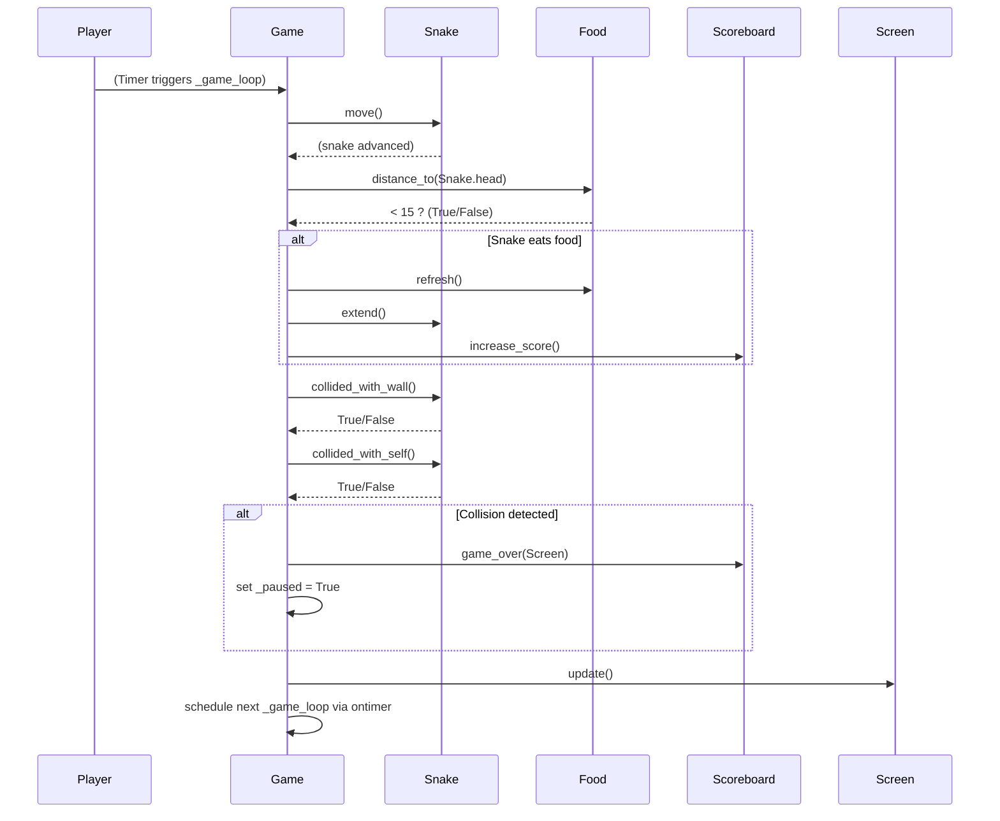
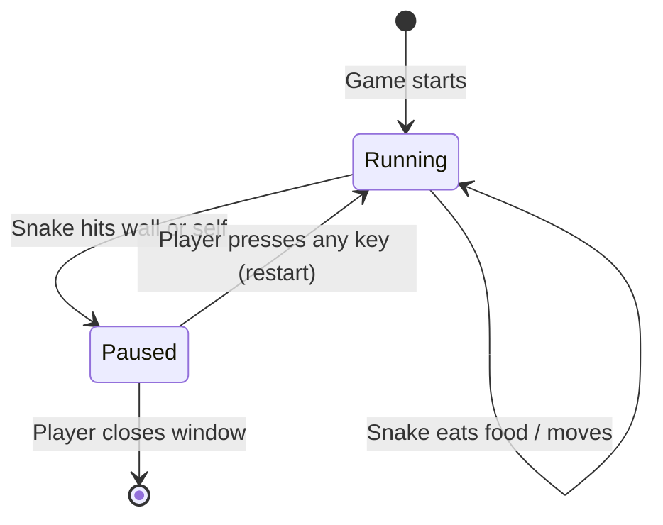

# 🐍 Snake Game (Python, Turtle, OOP)

This project is a modern, event-driven, **Object-Oriented** implementation of the classic Snake Game using Python’s `turtle` graphics.  

It follows **OOP best practices**:  
- **Data Abstraction**: Game logic is encapsulated in classes (`Snake`, `Food`, `Scoreboard`, `Game`).  
- **Encapsulation & Information Hiding**: Internal state is private (`_attributes`), exposed only via properties/methods.  
- **Pythonic getters/setters**: Read-only access is provided via `@property` (e.g. `snake.head`, `food.position`), instead of explicit getters and setters.  

---

## 📂 Modules Overview

- **`snake.py`** → Snake body, movement, growth, collision detection.  
- **`food.py`** → Food item that spawns randomly.  
- **`scoreboard.py`** → Score tracking and game over messages (with blinking text).  
- **`game.py`** → Orchestrates the game: screen setup, loop, event handling.  
- **`main.py`** → Entry point (launches the game).  

---

## Installation

- Clone this repo and navigate to the project folder
- Use Python 3.8.5 from [pyenv] [pip](https://github.com/pyenv/pyenv)
- Create a virtual environment usinng [venv](https://docs.python.org/3/library/venv.html)
- Install requirements.txt

```bash
python3 -m pip install -r requirements.txt
```
- Enjoy

```bash
python3 main.py
```

## UML Class Diagram



## Sequence Diagram – Game Loop Iteration



## State Diagram – Gameplay Lifecycle



## License

[MIT](https://choosealicense.com/licenses/mit/)